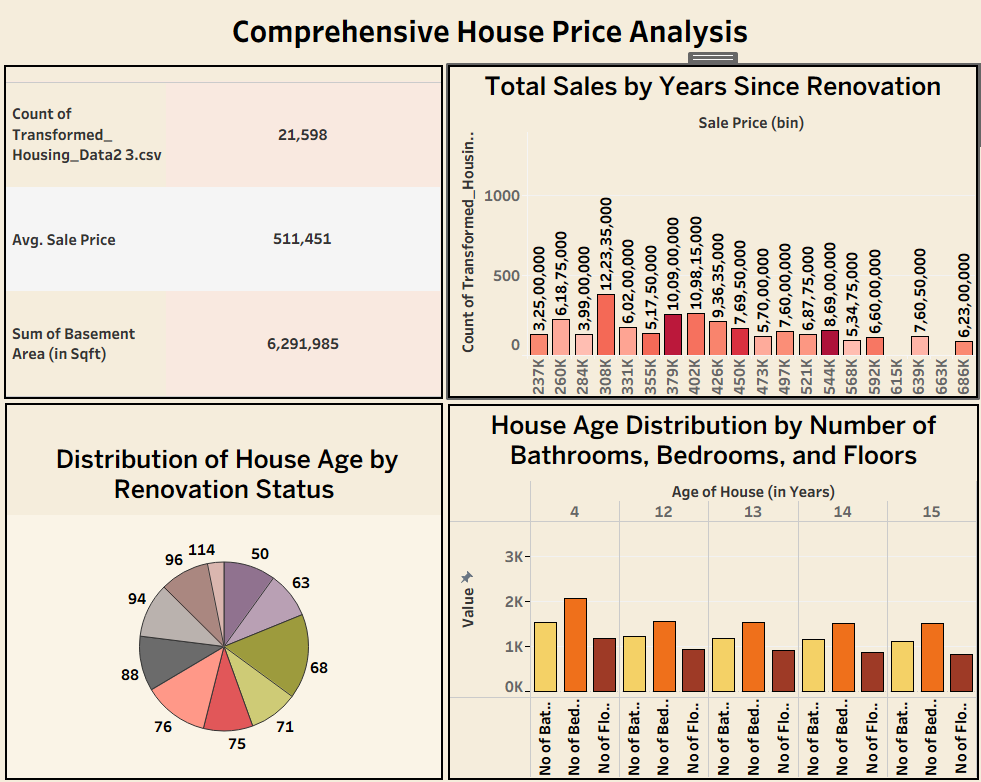

# 🏠 Housing Price Analysis

A comprehensive **Housing Price Analysis** project developed using **Tableau** and a responsive **HTML, CSS, and JavaScript** website to visualize and present insights from housing market data.

---

## 📌 Project Overview

This project analyzes housing market data to identify important trends and patterns affecting house prices. Interactive Tableau dashboards and stories are used to present meaningful insights, while the website provides an easy-to-use interface for viewing the project.

---

## 🌐 Live Demo

- 📖 Primary: Story1
  https://public.tableau.com/app/profile/kalam.sudheer.akash/viz/Book56_17829672736680/Story1?publish=yes

- 📊 Secondary: Dashboard
  https://public.tableau.com/app/profile/kalam.sudheer.akash/viz/Book56_17829672736680/Dashboard1?publish=yes

---


## 📸 Dashboard Screenshots

### 🏠 Main Dashboard



---

### 📊 Distribution of Houses Age By Renovation Status


---

### 🏡 House Age Analysis Distribution By No.of Bathrooms,Bedrooms and Floors


---

### 💰 Total Sales Analysis By Years Since Renovation


---

## 🎯 Objectives

- Analyze housing market data.
- Visualize key performance indicators (KPIs).
- Identify factors affecting house prices.
- Create interactive dashboards and stories.
- Present insights through a responsive website.

---

## 🛠️ Technologies Used

- Tableau
- HTML5
- CSS3
- JavaScript
- Bootstrap
- Git & GitHub

---

## 📂 Project Structure

```
Housing-Price-Analysis/
│── README.md
│
└── Dewi/
    ├── Dashboard/
    │   ├── dashboard.png
    │   ├── Distribution of houses.png
    │   ├── House age.png
    │   └── Total sales.png
    ├── Dataset/
    ├── Tableau/
    ├── assets/
    ├── forms/
    ├── index.html
    ├── portfolio-details.html
    └── service-details.html
```

---

## 📊 Project Components

### 📁 Dataset
Contains the housing dataset used for analysis.

### 📈 Dashboard
Interactive Tableau dashboard showing:

- Total Sales
- Average Sale Price
- Basement Area
- House Age Distribution
- Sales by Years Since Renovation
- A Tableau Story presenting insights and conclusions from the analysis.

### 📦 Tableau Workbook
Includes the packaged Tableau workbook (`.twbx`) for easy access.

---

## 🎯 Project Outcome

- Successfully analyzed housing market data.
- Built interactive Tableau dashboards and stories.
- Developed a responsive website for project presentation.
- Generated meaningful insights from the dataset.

---

## ✨ Key Features

- Interactive Tableau Dashboard
- Story-based Data Visualization
- Responsive Web Interface
- Clean Project Structure
- Easy Navigation
- Data-Driven Insights

---

## 🚀 How to Run

1. Clone the repository

```
git clone https://github.com/sudheerakash/Housing-Price-Analysis.git
```

2. Open the project folder.

3. Open `index.html` in your browser.

4. To view the Tableau project, open the `.twbx` file using Tableau.

---

## 👨‍💻 Team Members

| Name | Roll Number |
|------|-------------|
| Kalam Sudheer Akash | 23PA1A0597 |
| Guntupalli Venkata Charan | 23PA1A0582 |
| Sreesanth Varma Datla | 23PA1A0557 |
| Bonthu Sri Teja | 23PA1A0535 |
| Shaik Mahab Jan | 23PA1A05M2 |

---

## 🎯 Project Outcome

- Successfully analyzed housing market data.
- Built interactive Tableau dashboards and stories.
- Developed a responsive website for project presentation.
- Generated meaningful insights from the dataset.

---

## 📌 Future Enhancements

- Machine Learning based Price Prediction
- Real-Time Data Integration
- Location-wise Analysis
- Advanced Filters
- Mobile Optimization

---

## 📚 Learning Outcomes

- Built interactive dashboards and stories using Tableau.
- Learned data cleaning and preprocessing.
- Improved data visualization skills.
- Developed a responsive website using HTML, CSS and JavaScript.
- Gained experience with Git and GitHub.
- Improved teamwork and project documentation.

---

## 🙏 Acknowledgements

- Tableau
- BootstrapMade (Website Template)
- GitHub
- SmartBridge
- Vishnu Institute of Technology

---


## 📜 License

This project was developed for academic and learning purposes.

---
